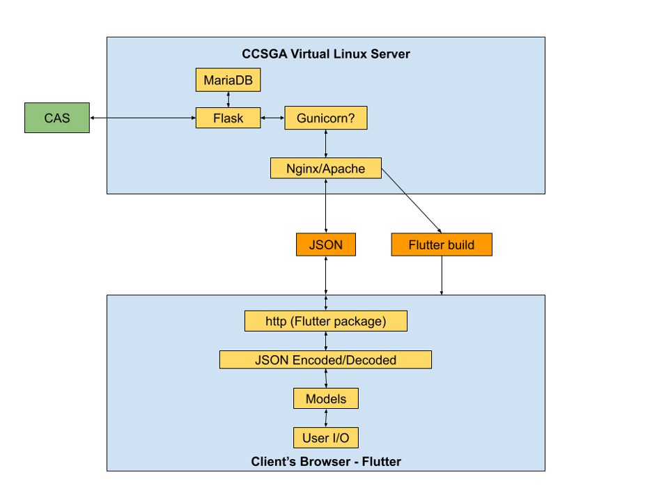
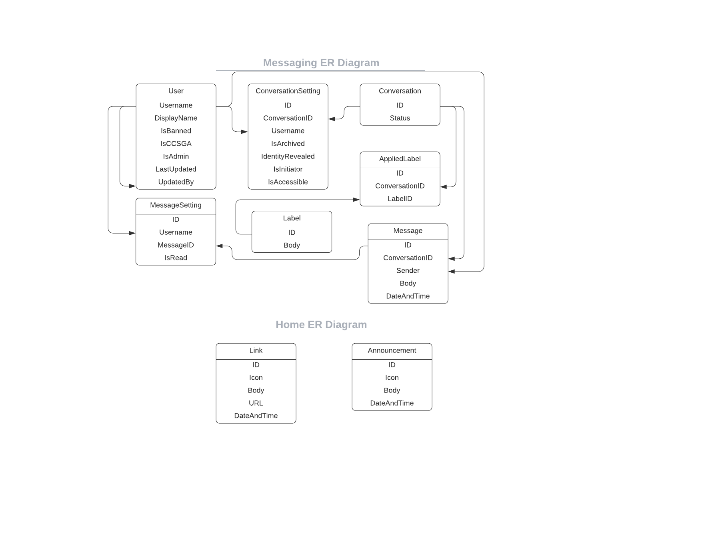

# CCSGA Comments
A system for secure, informal, comfortable communication between students and the student government at Colorado College.

## Deployment Documentation


## Developer Documentation

Once the system is set up and running successfully, use the following information and instructions to continue its development, operation, and maintenance.

#### System Architecture and File Structure



The frontend and the middleware of the system are created through the Flutter framework, written in Dart. The dart files stored within the repository at `students/lib/` are transpiled into a JavaScript web build placed at `students/build/web`, which a Flask backend serves to the browser whenever browser requests any routes not beginning with `/api`. Within the `lib` directory, each page in the user interface has its own sub-directory. `lib` also contains a `BasePage`, the parent of all other page classes, as well as `Models`, which hold blueprints for frequently used objects such as Conversations and Messages. There is also a `Navigation` directory within `lib`, which holds the logic for the side navigation and URL routing. Lastly, the `lib` directory also holds `main.dart`, which is the main class, and `DatabaseHandler.dart`, which constitutes our middleware. `DatabaseHandler` holds functions responsible for sending requests to the Database and digesting the Response before sending it back to the caller in a suitable format. `ChewedResponse` is a class that `DatabaseHandler` uses to determine success and potential error description based on the status code returned by the API. When the frontend needs to make an API request, it formats any required data as JSON, sends a request through the Dart http library, and awaits a JSON response from the server. 

The backend is written in Python and uses the Flask framework, connected to a MariaDB (MySQL) database. Nginx, acting as a reverse proxy running on port 8443 on the virtual server, fields all requests directy and forwards them to the Gunicorn service running strictly locally on port 8000 on the virtual server. Gunicorn runs a Flask application encompassed within the files located at `/opt/ccsga_comments/backend` on the server. Most of the files at this location (or at least in the `backend` folder within the repository) are flask files. These include `__init__.py` (the main application entry point), `route_wrappers.py` (which provides useful wrapper functions for access-restricted routes), `database_handler.py` (which provides the interface for communicating with the database), `view_handler.py` (which enumerates routes for use by the Flutter application), and other files of the form `*_handler.py` (which constitute the API). Other files in `backend` include `config.py` and `.env`, which store certain sensitive and non-sensitive configuraton values that should stay within the virtual machine (i.e., they should not be included in version control, which is why sample versions of both are provided as templates in the repository). Finally, `requirements.txt` stores the current dependencies for the flask backend, and the `test` directory holds all of the API tests, which can be run as individual python programs after the developer signs into the website and pastes the required values into `.env`, as described in `.env_sample`.

The other backend components with which the Flask application interfaces are the MariaDB database and the CAS server. The former is a service, also running on the virtual machine, to which the application connects through the python mariadb library, while the latter is a separate server with which the application communicates through the python Flask-CAS library. 

#### API

In the `documentation` folder of this repository, we have placed [the document](/documentation/Messaging_Service_API.pdf) we have been using an an authority for consistent API development between frontend and backend. In the interest of encouraging future development, we have provided it as is, including iceboxed routes, notes, and general tasks for future development.

#### Database Entity Relationships


The core objects within the messaging system are Users, Conversations, and Messages. The Users table stores information from CAS (username and display name), information about special roles (i.e., if a user is banned, CCSGA, or an admin), and metadata regarding the updating of the user's roles. The Conversations table itself stores only the CCSGA-set status of each conversation, and the Messages table itself stores the sender, body, and timestamp of each message. 

The ConversationSettings and MessageSettings tables embody the many-to-many relationships between Users and Conversations and between Users and Messages, respectively. The ConversationSettings table contains some fields that represent actual settings of a specific User within the context of a specific conversation (i.e., whether or not the user has archived or revealed their identity within that conversation). In addition, the table also stores indicators of whether or not the user initated the conversation (used for determining access when a user is demoted from an admin or CCSGA role) and whether or not the user currently has access to the conversation. The latter is redundant currently, as a user's conversation access could be determined solely by their isInitiator flag or their isCCSGA/isAdmin status under the current setup. However, this method would become problematic if future functionality allowed students to copy other students when initiating conversations, since such other students are indifferentiable from ex-reps in terms of isInitiator and isCCSGA/isAdmin, but such other students should still have access to the conversation whereas ex-reps shouldn’t. Having an isAccessible field in ConversationSettings resolves this easily, so it is included in the table proactively. If future development moves in this direction, further thought should be given to this strategy; either isInitiator or isAccessible might need to change to something similar to becameInvolvedAsStudent to cover students who were copied on a conversation, were later promoted, and were even later demoted. 

The MessageSettings table is the sole location for recording which messages which users have read. When communicating the read or unread state of an entire conversation, the program should indicate that an entire conversation is read, for a given user, if and only if all messages in that conversation are marked as read for that user.

The Labels and AppliedLabels tables are the final two tables that back the messaging service. Labels simply have a field for the text body of each label, which should be unique throughout the table. AppliedLabels embody the many-to-many relationship between Labels and Conversations. This design was chosen with the potential of supporting a small, fixed number of labels (although the system does not work this way currently) and with the potential of allowing label objects to become more complex than simple strings, if desired in the future.

The database also includes two tables designed to be used if future development allows for a dynamic homepage. The Announcements table stores a string representation of an icon (the means of this representation remain to be determined), the announcement body, and the timestamp of the announcement. The Links table stores all of these attribtes as well as a URL to which a user is directed when clicking on that link.

#### Component Commands and Configuration Info

```bash
# Flutter -- run these commands from the `students` directory

# Run this every time `pubspec.yaml` changes, to install Flutter libraries
flutter pub get

# Run this every time `lib` changes, to rebuild the distribution that's located at students/build/web
flutter build web
```

```bash
# Flask -- run these commands from the root directory of the repository.
# Also make sure you're in the virtual environment when you run these, 
# as indicated by `(venv)` on the left of the command-line prompt.
# See the Deployment Documentation for more information 
# about entering the virtual environment automatically.

# Run the Flask server, accessible on https://<device.IP.or.domainname>:<port>
# Use this for development only!
flask run --cert=backend/cert.pem --key=backend/key.pem -p <port> -h 0.0.0.0

# If you have an copy of the repository where you do local development, 
# and you don't need CAS or SSL, you can run this command instead, 
# which serves on localhost:5000 by default
flask run
```

```bash
# Nginx

# Make changes to the configuration file (not necessary during routine operation and updating of the app)
sudo vim /etc/nginx/nginx.conf

# Check syntax of configuration file
sudo nginx -t

# Reload nginx (including after making changes to configuration file)
sudo systemctl restart nginx

# Check status of nginx
sudo systemctl status nginx
```

```bash
# Gunicorn

# Reload the gunicorn systemd service running on localhost:8000 (necessary in order to update app)
sudo systemctl restart ccsga-comments

# Check the status of said service
# Replace `status` with `start` to start the service or with `stop` to stop it
sudo systemctl status ccsga-comments

# Update localhost:8000 (and therefore <device.ip.or.domainname>:8443) with application changes
sudo cp -r path/to/updated/app/root/directory/students/build/web /opt/ccsga_comments/students/build
sudo cp -r path/to/updated/app/root/directory/backend/*.py path/to/updated/app/root/directory/backend/*.pem path/to/updated/app/root/directory/backend/.env path/to/updated/app/root/directory/backend/venv /opt/ccsga_comments/backend
sudo systemctl restart ccsga-comments

# Edit the systemd service that runs gunicorn (not necessary during routine operation and updating of the app)
sudo vim /etc/systemd/system/ccsga-comments.service
sudo systemctl daemon-reload
```

```bash
# MariaDB

# Enter MariaDB console
# When prompted, enter the password specified in your version of `backend/.env`.
mysql -u ccsgacomments -p ccsgacommentsdb

# Restart MariaDB service
sudo systemctl restart mariadb

# Check status of MariaDB service
sudo systemctl status mariadb
```

```sql
-- MariaDB console commands

-- To manually update roles in database, 
-- do not use simple `INSERT INTO Users` or `UPDATE Users` commands, 
-- since these don't update the other tables as is required when roles change.
-- The permissible exception is adding admins to the database BEFORE any conversations have been created.
-- Aside from that case, use the following commands instead.

-- Make a user an admin (side effect: removes the ban from this user if they are banned)
CALL add_admin('new_admin_username', 'username_of_any_existing_admin');

-- Remove a user's admin authorization
CALL remove_admin('admin_username_to_remove', 'username_of_any_existing_admin');

-- Make a user a CCSGA rep (side effect: removes the ban from this user if they are banned)
CALL add_ccsga('new_rep_username', 'username_of_any_existing_admin');

-- Remove a user's CCSGA rep authorization
CALL remove_ccsga('rep_username_to_remove', 'username_of_any_existing_admin');

-- Ban a user (side effect: removes any admin/CCSGA rep authorization from this user)
CALL add_ban('new_ban_username', 'username_of_any_existing_admin');

-- Remove a user's ban
CALL remove_ban('ban_username_to_remove', 'username_of_any_existing_admin');
```

#### Common Errors and Fixes

Error | Potential Fix
------|----
/usr/local/opt/python@3.9/bin/python3.9: Error while finding module specification for 'virtualenvwrapper.hook_loader'... | Update zsh/bash aliases to point to whichever version of python is specified in your version of the above message. Then pip install virtualenvwrapper
Commands out of sync; you can't run this command now | Make sure to get all of the cursor's values (and include a cur.nextset() in the code), if a SELECT command was just given, in the code. Also re-save one of the python files so the flask dev server knows to restart (if using the flask dev server), or restart the gunicorn process you're using (if using gunicorn) -- or restart the MariaDB service if that's easier.
`mariadb.OperationalError`, `mariadb.OperationalError`, or MariaDB query/command stalls | Re-save one of the python files so the flask dev server knows to restart (if using the flask dev server), or restart the gunicorn process you're using (if using gunicorn) -- or restart the MariaDB service if that's easier.
Backend logic changes aren't updating as expected | `(mariadb) > drop procedure <name_of_recently_changed_stored_procedure>` followed by `(venv) $ python path/to/project/root/backend/database_handler.py`
Backend response isn't updating based on a change of permissions in database | Cause flask to refresh, or restart gunicorn, whichever applies
Getting unexpected value for a boolean result from a database query | Make sure to be unpacking the tuple you get back as a row from the database, not just converting the result of the entire row to a boolean
flask.cli.NoAppException: Could not import "backend.backend". or flask.cli.NoAppException: Could not import "backend". | Make sure you're in the repo root directory (i.e., the one _containing_ the backend folder, not the backend folder itself) when you execute `flask run...`. If that doesn't solve it, a seemingly band-aid solution is to assign the absolute path for `backend` to `FLASK_APP` in `~/.bash_profile`, rather than assigning just `backend`.
Runtime Error: Failed to Create Exception | Make sure the mariadb connection is still open.
Flask isn't finding backend/key.pem or backend/cert.pem even though you're in the project root directory | Make sure the user running flask has permission to access the files (i.e., use `chown` and `chgrp` to change then owner and the group of those files so that those files look like all the others when you run `ls -l backend`, or perhaps run flask as the root user in the case of something outside the scope of our home directories)
Cannot find the cert.pem and key.pem files | Use absolute paths to those files, as a band-aid solution

#### Other Maintenance Information
As development continues, you may want to install more python packages in the backend. Before running `pip3.9 install <package>` for this purpose, make sure you are in the virtual environment (see Deployment Documentation for more information). After running `pip3.9 install <package>`, enter the `backend` directory, then run `pip freeze > requirements.txt` to make sure the list of backend dependencies is kept up to date.

Running `database_handler.py` as a python program creates all the database tables and stored procedures therein __that do not already exist in the database__. Accordingly, even though all table/procedure changes should also be reflected in `database_handler.py`, if you wish to alter a table, you will have to use an `ALTER TABLE` command in the MariaDB console (unless you're willing to drop the entire table, in which case you can thereafter run `database_handler.py` if it reflects your changes). If you wish to create a stored procedure that you've added to `database_handler.py`, simply run `database_handler.py` as a python program. If you wish to make update an existing stored procedure according to how you've rewritten it in `database_handler.py`, give the command `drop procedure <procedure_name>;` in the MariaDB console before running `database_handler.py`.
