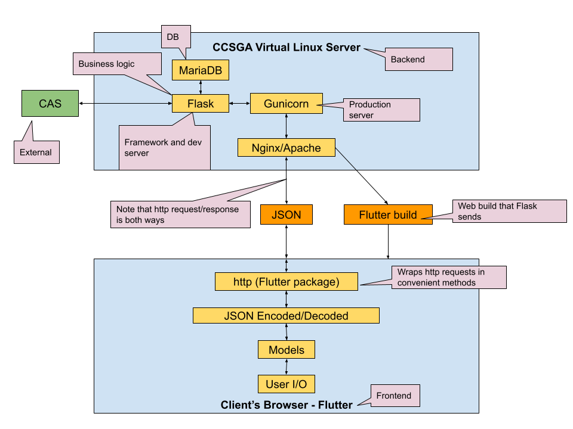

# CCSGA Comments
A system for secure, informal, comfortable communication between students and the student government at Colorado College.

## Deployment Documentation

#### Development/Production Environment Setup

The following are instructions from setting up a development or production environment on a CentOS 8.3.2011 machine on which the developer has super-user privileges:
1. Install programs: `sudo dnf install git vim gcc openssl-devel bzip2-devel libffi-devel zlib-devel make screen mariadb-server mariadb_config mariadb-devel snapd mod_ssl`
   1. For the production environment: skip `git` if you will be using another means of transferring files, and skip `snapd` if you will be producing the Flutter build elsewhere and transferring the resulting files to the production device.
   2. Note that while these are the programs installed in this development process, they are not a definitive list. For example, developers may choose to install any text editor instead of vim specifically, and screen is a convenience if desired for assisting in development. In short, developers should feel free to use common sense when installing the above programs.
   3. Note: the above command is a condensed version of the installation process actually experienced; since certain programs may be dependencies for others, the above command may not work as a single unit.
2. Install python3.9; several of the programs in the previous step are there solely for this purpose.
3. For development: in your account's home directory on the server, clone the repository from GitHub using the following command. Rename it as desired; for the purposes of these instructions, the name “ccsga_comments” will be assumed for the root directory of the repository.

```bash
git clone https://github.com/CP499ColoradoCollege/Gecko.git
```

4. Configure the server firewall to allow TCP connections for the ports on which the web server will run during development and on which Nginx will run in production (and which the CAS administrator will authorize/has authorized as CAS services)—for each port, replace 8001 with the desired number in the following command:

```bash
sudo firewall-cmd --zone=public --add-port=8001/tcp --permanent
sudo firewall-cmd --reload
```

5. Create a self-signed certificate/key pair. For development, place them in the `backend` folder within the project; for production, place them in your account's home folder for now. Make sure not to commit these files to version control! If you're cloning our project repository, they should already be git-ignored. Note that this is only relevant if this instance of the application will use SSL (e.g., integration with CAS requires SSL, but the instance on the personal computer of one of the developers uses simple http since local integration with CAS there is impossible).

```bash
openssl req -x509 -nodes -newkey rsa:4096 -keyout key.pem -out cert.pem -days 365
```

6. For development: add the following commands to `~/.bash_profile` (note that the first one will cause a complaint if the developer logs in again before setting up the python virtual environment as specified below):

```bash
source ~/ccsga_comments/backend/venv/bin/activate
export FLASK_ENV=development
export FLASK_APP=backend
```

7. Set up mariadb, including enabling it as a systemd service and running the mysql_secure_installation program. DigitalOcean provides [an excellent list of instructions](https://www.digitalocean.com/community/tutorials/how-to-install-mariadb-on-centos-8) for doing so; mariadb-server should be installed already after Step #1 above. Remember the root password for later use.

#### Product Compilation and Installation

1. Frontend setup (only necessary for development, or wherever you will actually be producing the Flutter build from the Dart code):
   1. Create a symlink from `/var/lib/snapd/snap` to `/snap`
   2. Add `/var/lib/snapd/snap/bin` to the PATH environment variable (most likely by editing and then re-running `source ~/.bashrc`)
   3. Install flutter. The flutter website has [comprehensive directions](https://flutter.dev/docs/get-started/install/linux) for doing so, although not all of the output from `flutter doctor` needs to be fixed, since development for this project does not include running an application on an iOS or Android simulator.
   4. Switch to the flutter beta channel and enable the web feature: 
   
   ```bash
   flutter channel beta
   flutter upgrade
   flutter config --enable-web
   ```

   5. With the ccsga_comments/frontend directory as the present working directory, run `flutter pub get`
      1. Run this command every time `ccsga_comments/frontend/pubspec.yaml` changes for any reason.
   6. In ccsga_comments/frontend, run `flutter build web`
      1. Run this command every time the frontend is edited (i.e., every time files in `ccsga_comments/frontend/lib` are modified) 
2. Set up the python virtual environment for the backend:
   1. Install virtualenv: `pip3.9 install virtualenv`
   2. With ccsga_comments/backend as the present working directory, run `virtualenv venv` to create a subdirectory, called “venv,” to house the virtual environment.
   3. In ccsga_comments/backend, run `source venv/bin/activate` to enter the virtual environment. 
      1. Note that this command will need to be run every time the developer logs in, so the developer may wish to add the command (substituting the absolute path for `venv/bin/activate`) to their `~/.bash_profile` file if they have not done so already.
      2. The indication of having entered the virtual environment successfully is having `(venv)` on the left of the command-line prompt.
3. Install python dependencies: from the `backend` directory, run `pip3.9 install -r requirements.txt`
4. Database setup:
   1. Connect to mariadb using `mariadb -u root -p`
      1. When prompted, enter the root password created when setting up mariadb.
   2. Execute the following commands (substituting in values of your own choice where specified): 

   ```sql
   CREATE DATABASE choose_a_database_name;
   CREATE USER 'choose_a_username'@'localhost' IDENTIFIED BY 'choose_a_password';
   GRANT ALL PRIVILEGES ON database_name_here.* TO 'username_here'@'localhost';
   FLUSH PRIVILEGES;
   exit
   ```

   3. Check access with `mysql -u username_here -p database_name_here`
5. Additional backend setup:
   1. In the `backend` directory, create a copy of `config.py.blank` and name it `config.py`. Also create a copy of `.env_sample` and call it `.env`. Make sure not to track `config.py` or `.env` in version control (they should already be git-ignored, if you're working in a clone of the repository). In `.env`, enter the correct database credentials from the database setup step (“`localhost`” can stay), and follow the instructions therein for the testing values whenever you need to run the tests. In `config.py`, enter any random, sufficiently long (16 to 32 bytes) value for the secret key.
   2. Run `database_handler.py` as a python program. This creates the tables and stored procedures for the database.
   3. Log into the database using `mysql -u username_here -p database_name_here` and insert the first admin user for the website (who can later add other admins through the frontend) using a normal `INSERT` command (use the admin's own username, or `NULL`, as the value for the `updatedBy` foreign key). Important note: this is the only time a normal `INSERT` or `UPDATE` command is the correct way to modify a user's roles, due to the complex ways various values in different tables change when a user's roles change. If a change to a user's roles must be made directly in the database after the database has started accruing conversations, use the appropriate stored procedure instead (see Developer Documentation).
 
   ```sql
   INSERT INTO Users (username, displayName, isBanned, isCCSGA, isAdmin, rolesLastUpdated, updatedBy) VALUES ('new_admin_username', 'New Admin Display Name', 0, 0, 1, UTC_TIMESTAMP(), NULL);
   ```
6. For development: if you want to run the Flask development server (according to the commands under "Component Commands and Configuration Info") and have not yet logged in again since editing `~/.bash_profile`, execute that file: `source ~/.bash_profile`

#### Extra Production Setup: The Nginx/Gunicorn Stack

For simplicity, the following steps assume: 
1. You have a copy of the codebase, named `ccsga_comments`, located in your home folder on the server.
2. It includes an already-produced build of the Flutter project at `ccsga_comments/frontend/build/web` as specified in "Product Compilation and Installation."
3. It also includes a `venv` folder containing a virtual environment in which you have already installed the backend dependencies as specified in "Product Compilation and Installation." 

Feel free to adapt these instructions, for example, to use `scp` and a different copy of the codebase (that still fulfills assumptions 2 and 3) instead.

[This DigitalOcean guide](https://www.digitalocean.com/community/tutorials/how-to-serve-flask-applications-with-gunicorn-and-nginx-on-centos-7) is helpful as another resource to have on hand for this process.

1. Install Nginx and Gunicorn
   1. `sudo dnf install nginx`
   2. Gunicorn is a pip-installed package, so it should already be installed by the assumptions above!
2. Set up subdirectories within /opt

   ```bash
   cd /opt
   sudo mkdir ccsga_comments
   sudo mkdir /opt/ccsga_comments/frontend/build
   sudo mkdir /opt/ccsga_comments/backend
   ```

3. Move or copy `key.pem` and `cert.pem` (created in the Development/Production Environment Setup section) to `/opt/ccsga_comments/backend`
4. Run the following commands now, as well as every time you want to update the app with new changes (after producing the flutter build). If the codebase from which you'll be copying doesn't contain a `config.py` file and a `.env` file, follow the relevant instructions in the "Additional backend setup" step of the Product Compilation and Installation section to create copies for `/opt/ccsga_comments/backend`.

```bash
sudo cp -r ~/ccsga_comments/frontend/build/web /opt/ccsga_comments/frontend/build
sudo cp -r ~/ccsga_comments/backend/*.py ~/ccsga_comments/backend/.env ~/ccsga_comments/backend/venv /opt/ccsga_comments/backend
```

5. Set up Gunicorn
   1. Create a systemd unit file for Gunicorn at `/etc/systemd/system/ccsga-comments.service` with these contents:

   ```
   [Unit]
   Description = Gunicorn instance to serve CCSGA Comments App
   After = network.target
   
   [Service]
   PermissionsStartOnly = true
   PIDFile = /run/ccsga_comments/ccsga_comments.pid
   User = root
   Group = nginx
   WorkingDirectory = /opt/ccsga_comments
   Environment = "PATH=/opt/ccsga_comments/backend/venv"
   ExecStartPre = /bin/mkdir /run/ccsga_comments
   ExecStartPre = /bin/chown -R root:nginx /run/ccsga_comments
   ExecStart = /opt/ccsga_comments/backend/venv/bin/gunicorn --workers 3 --certfile backend/cert.pem --keyfile backend/key.pem -b localhost:8000 --pid /run/ccsga_comments/ccsga_comments.pid backend:app
   ExecReload = /bin/kill -s HUP $MAINPID
   ExecStop = /bin/kill -s TERM $MAINPID
   ExecStopPost = /bin/rm -rf /run/ccsga_comments
   PrivateTmp = true

   [Install]
   WantedBy = multi-user.target
   ```

   2. Create a file at `/etc/systemd/system/ccsga-comments.service.d/override.conf` with this single line: `After=mariadb`
   3. Run the following commands:
      1. `sudo systemctl daemon-reload` since you just modified the ccsga-comments unit file
      2. `sudo systemctl start ccsga-comments` to start the ccsga-comments Gunicorn service
      3. `sudo systemctl enable ccsga-comments` so it starts automatically upon boot
      4. `sudo systemctl status ccsga-comments` to make sure it's working. If not, `sudo journalctl --since “5 minutes ago”` (substitute whatever timeframe) is helpful
6. Set up Nginx
   1. Execute the following commands to create copies of the key and certificate:
   
   ```bash
   sudo mkdir -p /etc/pki/nginx/private
   sudo cp /opt/ccsga_comments/backend/cert.pem /etc/pki/nginx
   sudo cp /opt/ccsga_comments/backend/key.pem /etc/pki/nginx/private
   sudo chmod 755 /etc/pki/nginx/private
   sudo chmod 644 /etc/pki/nginx/private/key.pem
   sudo chmod 644 /etc/pki/nginx/cert.pem
   ```

   2. Edit the file at `/etc/nginx/nginx.conf` to use SSL and to proxy requests to the Gunicorn service, by following these instructions:
      1. Comment out (using #'s) the entire server block that begins with `listen 80 default_server;`
      2. Uncomment the server block preceded by the comment, “Settings for a TLS enabled server,” and change it to look like this (using a different port instead of 8443 if needed):
      
      ```
      server {
          listen       8443 ssl http2 default_server;
          listen       [::]:8443 ssl http2 default_server;
          server_name  _;
      
          ssl_certificate "/etc/pki/nginx/cert.pem";
          ssl_certificate_key "/etc/pki/nginx/private/key.pem";
          ssl_session_cache shared:SSL:1m;
          ssl_session_timeout  10m;
          ssl_ciphers PROFILE=SYSTEM;
          ssl_prefer_server_ciphers on;

          # Load configuration files for the default server block.
          include /etc/nginx/default.d/*.conf;

          location / {
              # checks for static file, if not found proxy to app
              try_files $uri @proxy_to_app;
          }

          location @proxy_to_app {
              proxy_set_header Host $http_host;
              proxy_set_header X-Real-IP $remote_addr;
              proxy_set_header X-Forwarded-For $proxy_add_x_forwarded_for;
              proxy_set_header X-Forwarded-Proto $scheme;
              # we don't want nginx trying to do something clever with
              # redirects, we set the Host: header above already.
              proxy_redirect off;
              proxy_pass https://localhost:8000;
          }
      
          error_page 404 /404.html;
              location = /40x.html {
          }
      
          error_page 500 502 503 504 /50x.html;
              location = /50x.html {
          }
      }
      ```

   3. Run the following commands:
      1. `sudo nginx -t` to check the syntax of that configuration file
      2. `sudo systemctl start nginx`
      3. `sudo systemctl enable nginx` so it starts automatically upon boot
      4. `sudo systemctl status nginx` to make sure it's working
7. If you've completed the database-related steps under "Product Compilation and Installation," the website should be accessible at the server's IP address/domain name on whatever port you specified on the `listen` lines of the Nginx configuration file (albeit with a self-signed certificate, so you'll have to click through an SSL warning in your browser)!

#### Automatic Database Backup Setup

1. Create a new user who will automatically run the recurring backup command. The steps in this section and below assume use of the username `cronuser` in this step. 
   
   ```bash
   sudo useradd cronuser
   sudo passwd cronuser # optional. If creating a password, store it somewhere secure.
   ```

2. Create a new database user with the specific permissions for creating backups (run `mysql -u root -p` to enter to MariaDB prompt):

   ```sql
   GRANT LOCK TABLES, SELECT, RELOAD on *.* to 'choose_a_username'@'localhost' identified by 'choose_a_password';
   FLUSH PRIVILEGES;
   ```

3. Copy the `backup_database` file from the `backend` directory of this repo to `cronuser`'s home folder:
   1. `sudo cp ~/ccsga_comments/backend/backup_database /home/cronuser/`
   2. Edit the file (the version in `/home/cronuser`) to contain the MariaDB username and password from the previous step and the database name of the database for the project.
   3. Change the owner and group of that file so that `cronuser` can run it:

      ```bash
      sudo chown cronuser /home/cronuser/backup_database
      sudo chgrp cronuser /home/cronuser/backup_database
      ```

4. Create a new crontab for `cronuser`, by running `sudo crontab -u cronuser -e` and pasting the following code (updating the value for maintainer_email). This code runs backup_database, notifies the maintainer if something goes wrong, and logs any output.

   ```bash
   #!/bin/bash

   SHELL=/bin/bash
   maintainer_email=insert_maintainer_address_here@emaildomain.com

   # The following code (0 * * * *) indicates that cron should run the command at the top of every hour
   0 * * * * backup_output=$(source ./backup_database 2>&1) || echo -e "To: $maintainer_email\nSubject: CCSGA Comments Error: backup_database\n\n$backup_output" | /sbin/sendmail -t ; echo "$backup_output"
   ```
   
5. Once the cron job should have run at least once, check if `cronuser` is unauthorized to use `cron` (by checking `/var/log/cron` for `PAM ERROR (Permission denied)` or `FAILED to authorize user with PAM (Permission denied)`). If it is not authorized, add `+:cronuser:cron crond :0 tty1 tty2 tty3 tty4 tty5 tty6` before the first rule of `/etc/security/access.conf` and then check again once the cron job should have run again.
6. Other aspects that are good to test/check:
   1. Database backup is complete and correct (on the development system, use the instructions in the Developer Documentation section to restore the database from a backup)
   2. Emails are delivered successfully when errors occur (`mailq` is helpful for understanding why emails might not be delivered if the cron job is running)
   3. See the Developer Documentation section for more information about how to determine the status of the cron job

## Developer Documentation

Once the system is set up and running successfully, use the following information and instructions to continue its development, operation, and maintenance.

#### System Architecture and File Structure



The frontend and the middleware of the system use the Flutter framework and are written in Dart. The Dart files stored within the repository at `frontend/lib/` are transpiled into a JavaScript web build placed at `frontend/build/web`, which a Flask backend serves to the browser whenever the browser requests any routes not beginning with `/api`. Within the `lib` directory, each page in the user interface has its own sub-directory. `lib` also contains a `BasePage`, the parent of all other page classes, as well as `Models`, which holds blueprints for frequently used objects such as Conversations and Messages. There is also a `Navigation` directory within `lib`, which holds the logic for the side navigation and URL routing. Lastly, the `lib` directory also holds `main.dart`, which is the main class, and `DatabaseHandler.dart`, which constitutes our middleware. `DatabaseHandler` holds functions responsible for sending requests to the Database and digesting the response before sending it back to the caller in a suitable format. `ChewedResponse` is a class that `DatabaseHandler` uses to determine success and potential error description based on the status code that the API returns. When the frontend needs to make an API request, it formats any required data as JSON, sends a request through the Dart http library, and awaits a JSON response from the server. 

The backend is written in Python and uses the Flask framework, connected to a MariaDB (MySQL) database. Nginx, acting as a reverse proxy running on port 8443 on the virtual server, fields all requests directly and forwards them to the Gunicorn service running strictly locally on port 8000 on the virtual server. Gunicorn runs a Flask application encompassed within the files located at `/opt/ccsga_comments/backend` on the server. Many of the files at this location (or at least in the `backend` folder within the repository) are Flask files. These include `__init__.py` (the main application entry point), `route_wrappers.py` (which provides useful wrapper functions for access-restricted routes), `database_handler.py` (which provides the interface for communicating with the database), `view_handler.py` (which enumerates routes related to the Flutter navigation and build), and other files of the form `*_handler.py` (which constitute the API). Other files in `backend` include `config.py` and `.env`, which store certain sensitive and non-sensitive configuraton values that should stay within the virtual machine (i.e., they should not be included in version control, which is why sample versions of both are provided as templates in the repository instead). Additionally, `requirements.txt` stores the current dependencies for the flask backend, and the `test` directory holds all of the API tests, which can be run as individual python programs after the developer signs into the website and pastes the required values into `.env`, as described in `.env_sample`. Finally, `backup_database` is a bash script that can be set to run automatically (e.g., using cron) to generate a week's worth of complete backups of the database structure and data.

The other backend components with which the Flask application interfaces are the MariaDB database and the CAS server. The former is a service, also running on the virtual machine, to which the application connects through the python mariadb library, while the latter is a separate server with which the application communicates through the python Flask-CAS library. 

#### API

In the `documentation` folder of this repository, we have placed [the API document](/documentation/Messaging_Service_API.pdf) we have been using an an authority for consistent API development between frontend and backend. In the interest of encouraging future development, we have provided it as is, including iceboxed routes, notes, and general tasks for future development.

#### Database Entity Relationships


The core objects within the messaging system are Users, Conversations, and Messages. The Users table stores information from CAS (username and display name), information about special roles (i.e., if a user is banned, CCSGA, or an admin), and metadata regarding the updating of the user's roles. The Conversations table itself stores only the CCSGA-set status of each conversation, and the Messages table itself stores the sender, body, and timestamp of each message. 

The ConversationSettings and MessageSettings tables embody the many-to-many relationships between Users and Conversations and between Users and Messages, respectively. The ConversationSettings table contains some fields that represent actual settings of a specific User within the context of a specific conversation (i.e., whether or not the user has archived or revealed their identity within that conversation). In addition, the table also stores indicators of whether or not the user initated the conversation (used for determining access when a user is demoted from an admin or CCSGA role) and whether or not the user currently has access to the conversation. The latter is redundant currently, as a user's conversation access could be determined solely by their isInitiator flag or their isCCSGA/isAdmin status under the current setup. However, this method would become problematic if future functionality allowed students to copy other students when initiating conversations, since such other students are indifferentiable from ex-reps in terms of isInitiator and isCCSGA/isAdmin, but such other students should still have access to the conversation whereas ex-reps shouldn't. Having an isAccessible field in ConversationSettings resolves this easily, so it is included in the table proactively. If future development moves in this direction, further thought should be given to this strategy; either isInitiator or isAccessible might need to change to something similar to becameInvolvedAsStudent to cover students who were copied on a conversation, were later promoted, and were even later demoted. 

The MessageSettings table is the sole location for recording which messages which users have read. When communicating the read or unread state of an entire conversation, the program should indicate that an entire conversation is read, for a given user, if and only if all messages in that conversation are marked as read for that user.

The Labels and AppliedLabels tables are the final two tables that back the messaging service. Labels simply have a field for the text body of each label, which should be unique throughout the table. AppliedLabels embody the many-to-many relationship between Labels and Conversations. This design was chosen with the potential of supporting a small, fixed number of labels (although the system does not work this way currently) and with the potential of allowing label objects to become more complex than simple strings, if desired in the future.

The database also includes two tables designed to be used if future development allows for a dynamic homepage. The Announcements table stores a string representation of an icon (the means of this representation remains to be determined), the announcement body, and the timestamp of the announcement. The Links table stores all of these attribtes as well as a URL to which a user is directed when clicking on that link.

#### Component Commands and Configuration Info

```bash
# Flutter -- run these commands from the `frontend` directory

# Run this every time `pubspec.yaml` changes, to install Flutter libraries
flutter pub get

# Run this every time `lib` changes, to rebuild the distribution that's located at frontend/build/web
flutter build web
```

```bash
# Flask -- run these commands from the root directory of the repository.
# Also make sure you're in the virtual environment when you run these, 
# as indicated by `(venv)` on the left of the command-line prompt.
# See the Deployment Documentation for more information 
# about entering the virtual environment automatically.

# Run the Flask server, accessible on https://<device.IP.or.domainname>:<port>
# Use this for development only!
flask run --cert=backend/cert.pem --key=backend/key.pem -p <port> -h 0.0.0.0

# If you have an copy of the repository where you do local development, 
# and you don't need CAS or SSL, you can run this command instead, 
# which serves on localhost:5000 by default
flask run
```

```bash
# Nginx

# Make changes to the configuration file (not necessary during routine operation and updating of the app)
sudo vim /etc/nginx/nginx.conf

# Check syntax of configuration file
sudo nginx -t

# Reload nginx (including after making changes to configuration file)
sudo systemctl restart nginx

# Check status of nginx
sudo systemctl status nginx

# View HTTP access log
sudo less /var/log/nginx/access.log

# View HTTP error log
sudo less /var/log/nginx/error.log
```

```bash
# Gunicorn

# Reload the gunicorn systemd service running on localhost:8000 (necessary in order to update app)
sudo systemctl restart ccsga-comments

# Check the status of said service
# Replace `status` with `start` to start the service or with `stop` to stop it
sudo systemctl status ccsga-comments

# Update localhost:8000 (and therefore <device.ip.or.domainname>:8443) with application changes
sudo cp -r path/to/updated/app/root/directory/frontend/build/web /opt/ccsga_comments/frontend/build
sudo cp -r path/to/updated/app/root/directory/backend/*.py path/to/updated/app/root/directory/backend/.env path/to/updated/app/root/directory/backend/venv /opt/ccsga_comments/backend
sudo systemctl restart ccsga-comments

# Edit the systemd service that runs gunicorn (not necessary during routine operation and updating of the app)
sudo vim /etc/systemd/system/ccsga-comments.service
sudo systemctl daemon-reload
sudo systemctl restart ccsga-comments
```

```bash
# MariaDB

# Enter MariaDB console
# When prompted, enter the password specified in your version of `backend/.env`
mysql -u enter_database_username_here -p enter_database_name_here

# Restart MariaDB service
sudo systemctl restart mariadb

# Check status of MariaDB service
sudo systemctl status mariadb
```

```sql
-- MariaDB console commands

-- To manually update roles in database, 
-- do not use simple `INSERT INTO Users` or `UPDATE Users` commands, 
-- since these don't update the other tables as is required when roles change.
-- The permissible exception is adding admins to the database BEFORE any conversations have been created.
-- Aside from that case, use the following commands instead.

-- Make a user an admin (side effect: removes the ban from this user if they are banned)
CALL add_admin('new_admin_username', 'username_of_any_existing_admin');

-- Remove a user's admin authorization
CALL remove_admin('admin_username_to_remove', 'username_of_any_existing_admin');

-- Make a user a CCSGA rep (side effect: removes the ban from this user if they are banned)
CALL add_ccsga('new_rep_username', 'username_of_any_existing_admin');

-- Remove a user's CCSGA rep authorization
CALL remove_ccsga('rep_username_to_remove', 'username_of_any_existing_admin');

-- Ban a user (side effect: removes any admin/CCSGA rep authorization from this user)
CALL add_ban('new_ban_username', 'username_of_any_existing_admin');

-- Remove a user's ban
CALL remove_ban('ban_username_to_remove', 'username_of_any_existing_admin');
```

```bash
# cron, which automatically runs a script to generate database backups

# Update the automatically-run copy of backup_database after making changes to it in the repo
sudo cp ~/ccsga_comments/backend/backup_database /home/cronuserf

# Edit the crontab that specifies how to automatically run backup_database and whom to notify about errors
# Make sure to update the email address in this location whenever the software maintainer changes!
sudo crontab -u cronuser -e

# View a log of executed cron jobs
sudo less /var/spool/mail/cronuser # press Shift+G to jump to the bottom of file (to see the most recent jobs)
```

```bash
# Restoring the database from a backup
# IMPORTANT: Do not run this command lightly on the production server! 
# It will completely overwrite all of the data and structures in the database to resemble the backup exactly.

# 1. Either switch to cronuser...
sudo su cronuser
cd ~/backups

# ...or copy the backup file to a location where you have read access
sudo cp /home/cronuser/backups/insert_backup_filename.sql ~

# 2. Restore from the backup
# When prompted, enter the password specified in your version of `backend/.env`
mysql -u enter_database_username_here -p enter_database_name_here < path/to/backup/file.sql
```

#### Common Errors and Fixes

Error | Potential Fix
------|----
/usr/local/opt/python@3.9/bin/python3.9: Error while finding module specification for 'virtualenvwrapper.hook_loader'... | Update zsh/bash aliases to point to whichever version of python is specified in your version of the above message. Then `pip install virtualenvwrapper`
Commands out of sync; you can't run this command now | Make sure to get all of the cursor's values (and include a `cur.nextset()` in the code), if a `SELECT` command was just given, in the code. Also re-save one of the python files so the flask dev server knows to restart (if using the flask dev server), or restart the gunicorn process you're using (if using gunicorn) -- or restart the MariaDB service if that's easier.
`mariadb.OperationalError`, `mariadb.OperationalError`, or MariaDB query/command stalls | Re-save one of the python files so the flask dev server knows to restart (if using the flask dev server), or restart the gunicorn process you're using (if using gunicorn) -- or restart the MariaDB service if that's easier.
Backend logic changes aren't updating as expected | `(mariadb) > drop procedure <name_of_recently_changed_stored_procedure>` followed by `(venv) $ python path/to/project/root/backend/database_handler.py`
Backend response isn't updating based on a change of permissions in database | Cause flask to refresh, or restart gunicorn, whichever applies
Getting unexpected value for a boolean result from a database query | Make sure to be unpacking the tuple you get back as a row from the database, not just converting the result of the entire row to a boolean
flask.cli.NoAppException: Could not import "backend.backend". or flask.cli.NoAppException: Could not import "backend". | Make sure you're in the repo root directory (i.e., the one _containing_ the backend folder, not the backend folder itself) when you execute `flask run...`. If that doesn't solve it, a seemingly band-aid solution is to assign the absolute path for `backend` to `FLASK_APP` in `~/.bash_profile`, rather than assigning just `backend`.
Runtime Error: Failed to Create Exception | Make sure the mariadb connection is still open.
Flask isn't finding backend/key.pem or backend/cert.pem even though you're in the project root directory | Make sure the user running flask has permission to access the files (i.e., use `chown` and `chgrp` to change then owner and the group of those files so that those files look like all the others when you run `ls -l backend`, or perhaps run flask as the root user in the case of something outside the scope of our home directories)
Cannot find the `cert.pem` and `key.pem` files | Use absolute paths to those files, as a band-aid solution

#### Other Maintenance Information
As development continues, you may want to install more python packages in the backend. Before running `pip3.9 install <package>` for this purpose, make sure you are in the virtual environment (see Deployment Documentation for more information). After running `pip3.9 install <package>`, enter the `backend` directory, then run `pip freeze > requirements.txt` to make sure the list of backend dependencies is kept up to date.

Running `database_handler.py` as a python program creates all the database tables and stored procedures therein __that do not already exist in the database__. Accordingly, even though all table/procedure changes should also be reflected in `database_handler.py`, if you wish to alter a table, you will have to use an `ALTER TABLE` command in the MariaDB console (unless you're willing to drop the entire table, in which case you can thereafter run `database_handler.py` if it reflects your changes). If you wish to create a stored procedure that you've added to `database_handler.py`, simply run `database_handler.py` as a python program. If you wish to update an existing stored procedure according to how you've rewritten it in `database_handler.py`, give the command `drop procedure procedure_name_here;` in the MariaDB console before running `database_handler.py`.
